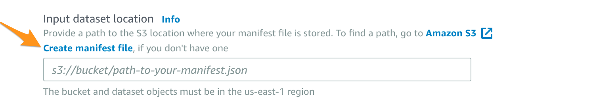
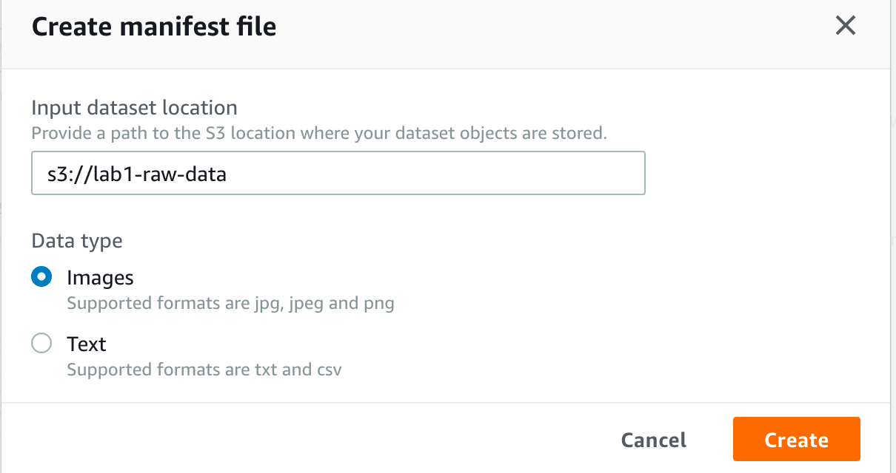
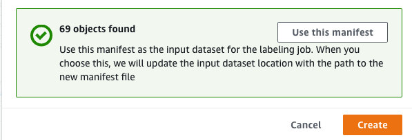
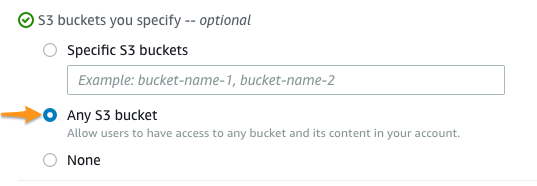
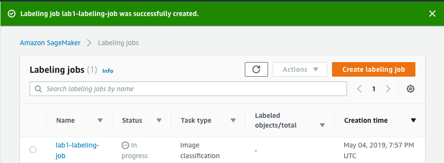
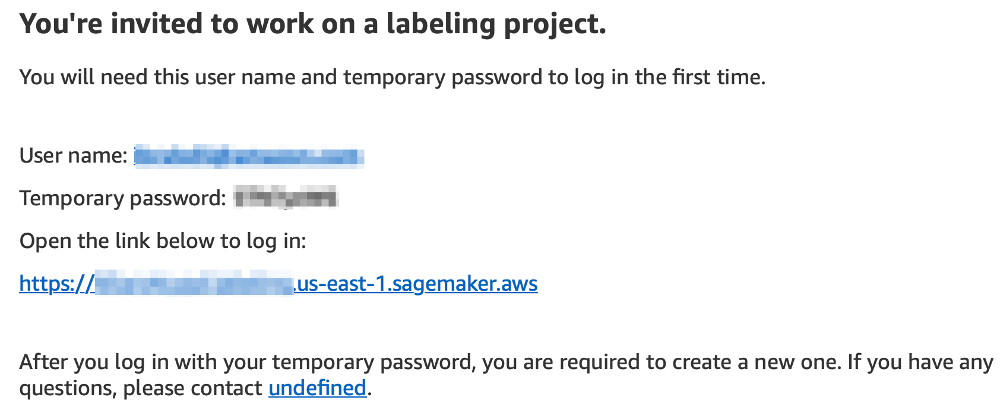
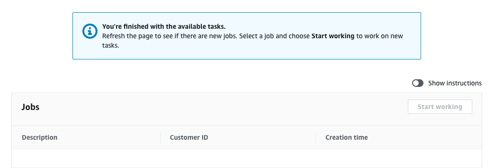
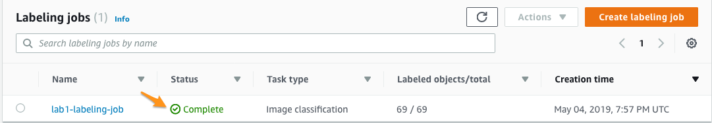

# LAB 1: Image classification transfer learning
## Introduction

  This lab is an end-2-end image classification. In this lab you'll learn how to fine-tuning using an existing pre-trained machine learning model on a different images dataset. The images dataset is called Caltech-256 dataset is used as a transfer learning dataset. In this lab, you will use the Amazon sagemaker image classification algorithm in transfer learning mode to fine-tune a pre-trained model (trained on imagenet data) to learn to classify a new dataset.
  
  The pre-trained model will be fine-tuned using caltech-256 dataset. Once the training is complete, the notebook shows how to host the trained model for inference. You'll be sending to the inference endpoint unseen images get a predition from the model you've trained.

## 1. Create a SageMaker notebook instance

You'll use Amazon SageMaker Jupyter Notebook instance to run the notebook.

1. Go to Amazon SageMaker Notebook in AWS Console at https://console.aws.amazon.com/sagemaker/home?region=us-east-1#/notebook-instances
2. Click on "*Create notebook instance*"

3. Give a name to your notebook (example: lab1-notebook)
4. Keep the Notebook instance type to *ml.t2.medium*
5. Under Permissions and encryption drop down the IAM role and select existing role. Example:


*Note*: If a role does not exist select to create one.
6. Leave the rest defaults and click on "*Create notebook instance*" at the bottom of the screen.

It'll take 3-5 min to create the instance. The following screenshot shows a successfully created notebook instance:
*Note*: The Status must show "*InService*".


7. Click on the "*Open Jupyter*" link under the "Actions" column. This will open a Juptyer notebook web interface similar to the below:


8. Download Lab1 Jupyter Notebook: [Lab 1-Transfer-learning-image-classifcation](https://www.dropbox.com/s/fiwagwtec4qsv7m/Lab%201-Transfer-learning-image-classifcation.ipynb?dl=1)
9. Upload the following Jupyter Notebook into your i


9. Click on the *Upload* button next to the file. The file will be uploaded into your Notebook instance:


10. Confirm that your file has been sucessfully uploaded by checking the last time modified:


## 2. Run the Notebook and Follow its instruction
1. Clik on the file "*Lab1 - Transfer-learning-image-classification.ipynb*" to open it
2. Click next to each cell and select the run button on the notebook


# LAB 2: 
## Introduction

Semantic Segmentation (SS) is the task of classifying every pixel in an image with a class from a known set of labels. In contrast, image classification generates only one label per image, and object detection generates a bounding box along with the label for each object in the image.

1. Download Lab2 Jupyter Notebook: [Lab2-Lab 2-Semantic-image-segmentation_pascalvoc](https://www.dropbox.com/s/cq26dieq67azsah/Lab%202-Semantic-image-segmentation_pascalvoc.ipynb?dl=1)

2. Upload the following Jupyter Notebook into your i


3. Click on the *Upload* button next to the file. The file will be uploaded into your Notebook instance:


4. Confirm that your file has been sucessfully uploaded by checking the last time modified:


## 2. Run the Notebook and Follow its instruction
1. Clik on the file "*Lab1 - Transfer-learning-image-classification.ipynb*" to open it
2. Click next to each cell and select the run button on the notebook


# LAB 3: Optional - Building Highly Accurate Datasets and Train Them with Machine Learning Models
Amazon SageMaker can make it easy for customers to to efficiently and accurately label the datasets required for training machine learning systems.

Labeling datasets is a critical phase of training any supervised machine learning models. Data scientists and developers can now easily train machine learning models on datasets labeled by Amazon SageMaker Ground Truth. Amazon SageMaker Training now accepts the labeled datasets produced in augmented manifest format as input through both AWS Management Console.

Steps involved in dataset labeling tasks:

- Store your data in Amazon S3,
- Create a labeling workforce,
- Create a labeling job,
- Get to work,
- Visualize results.

Steps involved in traiing the ML model and hosting it:

- Explore the dataset
- Create the SageMaker training job
- Deploy the model onto SageMaker Endpoint
- Setup an API Gateway to connect to the Model Hosting Endpoint


## Table of Contents
1. [Architecture](#architecture)
2. [Dataset labeling tasks with Amazon SageMaker Ground Truth ](#labelsteps)
3. [Training Model on SageMaker Ground Truth Dataset](#traininglsteps)
## 1. Architecture <a id="architecture"></a>

## 2. Dataset labeling tasks with Ground Truth <a id="labelsteps"></a>

### 2.1 Create S3 Buckets
#### 2.1.1 Create Raw Data bucket
1. Go to Amazon S3 in AWS Console at https://s3.console.aws.amazon.com/s3/
2. Click on Create bucket.
3. Under Name and region:

* Bucket name: Enter a bucket name-your-name-raw-data (example: lab1-raw-data)
* Choose US East (N. Virginia)
* Click Next

1. Leave default values for Configure Options screen and click Next
3. Click Next, and click Create bucket.

#### 2.1.2 Create Labeling Job Output bucket
1. Go back to Amazon S3 in AWS Console at https://s3.console.aws.amazon.com/s3/ 
2. Click on Create bucket.
3. Under Name and region:

* Bucket name: Enter a bucket name-your-name-label-output (example: lab1-label-output)
* Choose US East (N. Virginia)
* Click Next

4. Leave default values for Configure Options screen and click Next
5. Click Next, and click Create bucket.

#### 2.1.3 Create Training and Validation Job bucket
1. Go back to Amazon S3 in AWS Console at https://s3.console.aws.amazon.com/s3/ 
2. Click on Create bucket.
3. Under Name and region:

* Bucket name: Enter a bucket name-your-name-train-data (example: lab1-train-data)
* Choose US East (N. Virginia)
* Click Next

4. Leave default values for Configure Options screen and click Next
5. Click Next, and click Create bucket.

### 2.2 Download the raw data 
1. Donwload the raw data of images from the following link: [raw-data.zip](https://www.dropbox.com/s/irk9dnml01kjmzf/raw-data.zip?dl=1)
2. Save it on your machine and unzip it
### 2.3 Storing raw data in Amazon S3
1. Go to Amazon S3 in AWS Console at https://s3.console.aws.amazon.com/s3/
2. Click on the raw-data bucket you've created earlier
3. Click on Upload button on the top left corner of the console
4. Click on Add files button and select all the images that you unziped earlier and click on "*Upload*" button
### 2.4 Creating manifest file for the dataset
1. Go to Amazon SageMaker Ground Truth in AWS Console at https://console.aws.amazon.com/sagemaker/groundtruth?region=us-east-1
2. Click on "*Create labeling job*"
3. In the Specify Job Details page provide the following information:
    - Because you don't have a manifest file yet, you'll create on:
        - under the section "*Input dataset location*" click on the link "*Create manifest file*"
        
        - In the "*Create manifest file*" popup windows provide the path to your S3 bucket and folder for the raw-data that you've created previously. Leave the "images" for data type and click on Create button.
        
        - Once the manifest creation process completes it'll provide number of object found and option to use the manifest. Click on "*Use this manifest*" button
        

### 2.5 Creating the labeling Job
1. You'll be back on the main Job Details screen. Type the name of the job (example: lab1-labeling-job)
2. Under the "*Output dataset location*" put the path of the bucker you've created previsouly for the label output (example: s3://lab1-label-output)
3. Under "*IAM Role*" drop down the "*Choose option*" and select "*Create a new role*"
4. In the popup window select "*Any S3 bucket*"  and click on Create button.
5. Under the "*Task type*" select Image Classification and click on next
6. Under the "*Select Workers and configure tool*" provide the following information:

Amazon SageMaker Ground Truth gives us different options:

- Public workforce, backed by Amazon Mechanical Turk,
- Private workforce, backed by internal resources,
- Vendor workforce, backed by third-party resources.

The first option is probably the most scalable one. However, the last two may be a better fit if your job requires confidentiality, service guarantees, or special skills.

7. Workers: Select Private as you will send the labeling task to an internal team to your organization. In this lab the team will be yourself:
- Team Name: put a name for your team (example: lab1-private-team)
- Under Invite private annotators add your email address and any other team member of your group in the lab/workshop
- (Optional) Under Organization put your company name and divison
- (Optional) Leave contact email address empty

8. Under "*Image classification labeling tool*" you'll see a preview of the object in the raw dataset. Add the following label. example:
    - RH
    - LH
    - Add some decription on the it as well: (example: Classify the below image using the part number as well as the label on the part.)
    - Click on "*Submit*" at the bottom of the page to send the labeling job to the worker. In this case yourself from the email address.


### 2.6 Start working on the labeling Job
Once the labeling job is sucessfully submitted you'll receive an email from Amazon SageMaker labeling project requesting to work on a labeling project:

1. In the email inviting you to work on a labeling project you'll receive a username and password to login into the labeling console. Follow the procedure provided in the email.


2. Logging into the URL you received by email, you'll see the list of jobs you're assigned to.


3. When I click on the ‘Start working’ button, You'll see instructions as well as a first image to work on. Using the toolbox, you can zoom in and out, etc. This is pretty intuitive. Select the correct "*Label*" (example: LH or RH) depending what you observe on the image. You can use reference images from the downloaded assets.

4. Once you complete the labeling you'll receive a window message:


Also, you're Amazon SageMaker console job lebeling screen will show completed:

5. Click on the job name and you can observe the output of the labeling process. As you're aware of it this was a human labeling job. For large datasets (more thant 1000 objects) Ground Truth can automatically label the dataset.

Of course, our purpose is to use this information to train machine learning models. you can find it in the augmented manifest file stored in your bucket. For example, your manifest will be located in s3://lab1-label-output/lab1-labeling-job/manifests/output/output.manifes. This manifest file contains information about the first image, where you labeled the objects.

Here is an example of the augmented manifest output file:
```json
{
    "source-ref": "s3://lab1-rawdata/IMG_0085.JPG",
    "lab1-labeling-job": 0,
    "lab1-labeling-job-metadata": {
        "confidence": 0.95,
        "job-name": "labeling-job/lab1-labeling-job",
        "class-name": "RH",
        "human-annotated": "yes",
        "creation-date": "2019-05-04T20:26:41.638095",
        "type": "groundtruth/image-classification"
    }
}
```

Now you're ready to train the model with this dataset.

## 3. Training Model on SageMaker Ground Truth Dataset <a id="traininglsteps"></a>
 In earlier steps you used Amazon SageMaker Ground Truth to manage a private workforce for classifying all the parts in the images, thus creating a labeled dataset for training an Amazon SageMaker Image Classification model. Now you can proceed to explore the labeled dataset, post process it and train an image classification model in Amazon SageMaker.

### 3.1 Explore the labeled dataset
1. Go to Amazon S3 in AWS Console at https://s3.console.aws.amazon.com/s3/
2. Click on the label-output bucket you've created earlier (example: lab1-label-output)
3. Open the labeling job folder (example: lab1-labeling-job), then the folder called manifests and finaly open output folder.
4. Click on the check box next to "*output.manifest*" file and click on "*Donwload*" button

Below is the JSON object in the augmented manifest file that you've produced during labeling job. The below output have been formatted for ease of visualization. In the augmented manifest file, this will appear as a JSON object in a single line. Try to open in a text editor and explore its content.

```json
{
    "source-ref": "s3://lab1-rawdata/IMG_0085.JPG",
    "lab1-labeling-job": 0,
    "lab1-labeling-job-metadata": {
        "confidence": 0.95,
        "job-name": "labeling-job/lab1-labeling-job",
        "class-name": "RH",
        "human-annotated": "yes",
        "creation-date": "2019-05-04T20:26:41.638095",
        "type": "groundtruth/image-classification"
    }
}
{
    "source-ref": "s3://lab1-rawdata/IMG_0086.JPG",
    "lab1-labeling-job": 0,
    "lab1-labeling-job-metadata": {
        "confidence": 0.68,
        "job-name": "labeling-job/lab1-labeling-job",
        "class-name": "RH",
        "human-annotated": "yes",
        "creation-date": "2019-05-04T20:44:14.458699",
        "type": "groundtruth/image-classification"
    }
}
```
You can notice that the dataset has been label by human by looking at the key "human-annotated" with a value of "yes".

The *source-ref* is the Amazon S3 URI of the image file. Note that *lab1-labeling-job* (named after the Amazon SageMaker Ground Truth labeling job that produced the manifest file in the first place is the list of labels. The labels consist of the class-name (RH) labeled by human labeler.

### 3.2 Splitting the labeled dataset
The At this stage, you have fully labeled you dataset and you can train a machine learning model to classify images based on the categories you previously defined (LH or RH). You'll do so using the augmented manifest output of your labeling job - no additional file translation or manipulation required! 

First, we'll split our augmented manifest into a training set and a validation set using an 80/20 split.

Because the labeling job is a long process due to manual human annotation the following are a randomly split manifest files:

1. Please download each manifest files:
    - For training data: [train.manifest](./manifest/train.manifest)
    - click on the raw button on the top right hand and save the page as train.manifest on your local machine.
    - For validation data: [validation.manifest](./manifest/validation.manifest)
    - click on the raw button on the top right hand and save as validation.manifest on your local machine.

2. Once you've saved each file, open each manifest file and update the content with the correct path for each object. You'll be replacing the word *lab#* with your lab ID (example: lab1, lab2, lab3 or labX) in both manifest content. Below is an example:

Before:
```json
{"source-ref":"s3://lab#-rawdata/IMG_0085.JPG","lab#-labeling-job":0,"lab#-labeling-job-metadata":{"confidence":0.95,"job-name":"labeling-job/lab#-labeling-job","class-name":"RH","human-annotated":"yes","creation-date":"2019-05-04T20:26:41.638095","type":"groundtruth/image-classification"}}
{"source-ref":"s3://lab#-rawdata/IMG_0086.JPG","lab#-labeling-job":0,"lab#-labeling-job-metadata":{"confidence":0.68,"job-name":"labeling-job/lab#-labeling-job","class-name":"RH","human-annotated":"yes","creation-date":"2019-05-04T20:44:14.458699","type":"groundtruth/image-classification"}}
```

After:
```json
{"source-ref":"s3://lab3-rawdata/IMG_0085.JPG","lab3-labeling-job":0,"lab3-labeling-job-metadata":{"confidence":0.95,"job-name":"labeling-job/lab3-labeling-job","class-name":"RH","human-annotated":"yes","creation-date":"2019-05-04T20:26:41.638095","type":"groundtruth/image-classification"}}
{"source-ref":"s3://lab3-rawdata/IMG_0086.JPG","lab3-labeling-job":0,"lab3-labeling-job-metadata":{"confidence":0.68,"job-name":"labeling-job/lab3-labeling-job","class-name":"RH","human-annotated":"yes","creation-date":"2019-05-04T20:44:14.458699","type":"groundtruth/image-classification"}}
```
*Note*: you'll have to do a global search and replace the occurance of the "*lab#*" with yours.

### 3.3 Create the Amazon SageMaker training job
You'll now train an Amazon SageMaker Image Classification Model which takes the augmented manifest file from step as an input.


#### 3.3.3 Run the different cell of the notebook code

