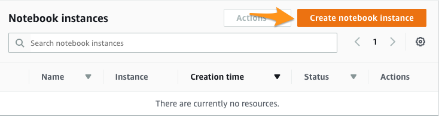
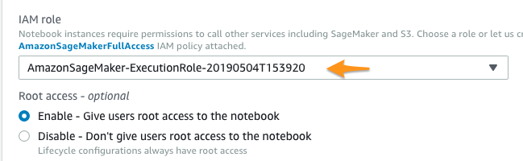
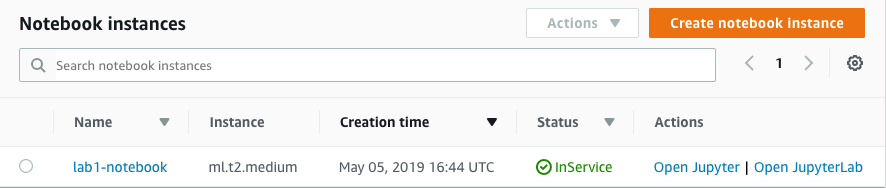
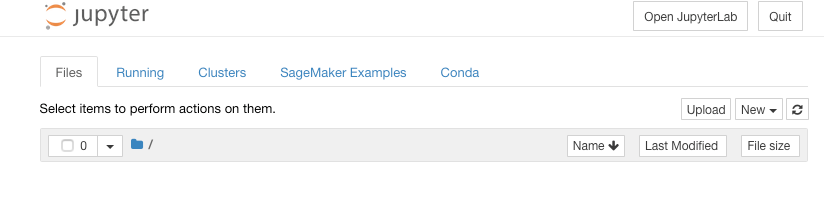
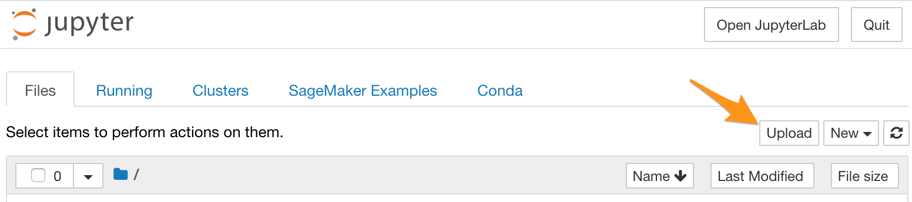
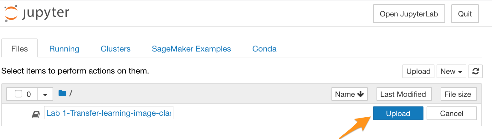
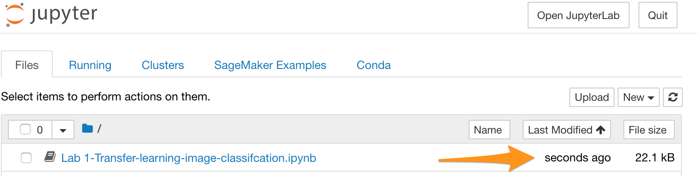
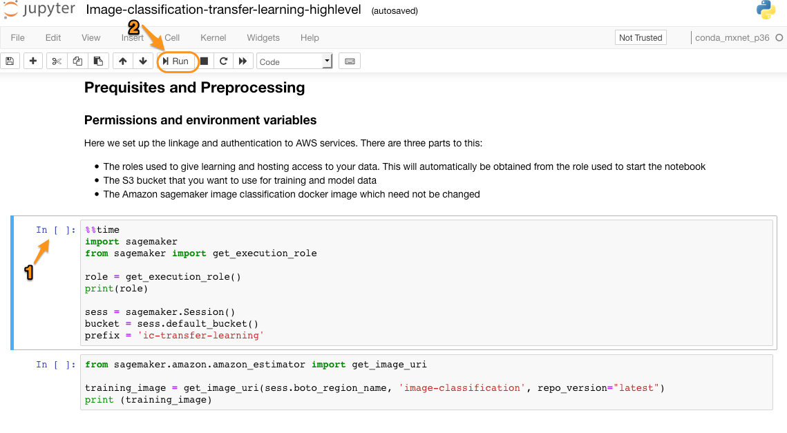
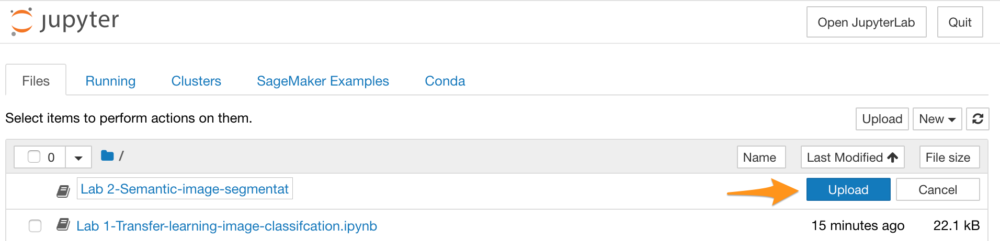
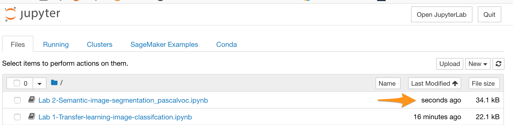

# LAB 1: Image classification transfer learning
## Introduction

  This lab is an end-2-end image classification. In this lab you'll learn how to fine-tuning using an existing pre-trained machine learning model on a different images dataset. The images dataset is called Caltech-256 dataset is used as a transfer learning dataset. In this lab, you will use the Amazon sagemaker image classification algorithm in transfer learning mode to fine-tune a pre-trained model (trained on imagenet data) to learn to classify a new dataset.
  
  The pre-trained model will be fine-tuned using caltech-256 dataset. Once the training is complete, the notebook shows how to host the trained model for inference. You'll be sending to the inference endpoint unseen images get a predition from the model you've trained.

## 1. Create a SageMaker notebook instance

You'll use Amazon SageMaker Jupyter Notebook instance to run the notebook.

1. Go to Amazon SageMaker Notebook in AWS Console at https://console.aws.amazon.com/sagemaker/home?region=us-east-1#/notebook-instances
2. Click on "*Create notebook instance*"

3. Give a name to your notebook (example: lab1-notebook)
4. Keep the Notebook instance type to *ml.t2.medium*
5. Under Permissions and encryption drop down the IAM role and select existing role. Example:

*Note*: If a role does not exist select to create one.
6. Leave the rest defaults and click on "*Create notebook instance*" at the bottom of the screen.

It'll take 3-5 min to create the instance. The following screenshot shows a successfully created notebook instance:
*Note*: The Status must show "*InService*".

7. Click on the "*Open Jupyter*" link under the "Actions" column. This will open a Juptyer notebook web interface similar to the below:

8. Download Lab1 Jupyter Notebook: [Lab 1-Transfer-learning-image-classifcation](https://www.dropbox.com/s/49j1ch08nvfv8bf/Lab%201-Transfer-learning-image-classifcation.ipynb?dl=1)

9. Upload the following Jupyter Notebook into your instance

9. Click on the *Upload* button next to the file. The file will be uploaded into your Notebook instance:

10. Confirm that your file has been sucessfully uploaded by checking the last time modified:

## 2. Run the Notebook and Follow its instruction
1. Clik on the file "*Lab1 - Transfer-learning-image-classification.ipynb*" to open it
2. Click next to each cell and select the run button on the notebook

# LAB 2: 
## Introduction

Semantic Segmentation (SS) is the task of classifying every pixel in an image with a class from a known set of labels. In contrast, image classification generates only one label per image, and object detection generates a bounding box along with the label for each object in the image.

1. Download Lab2 Jupyter Notebook: [Lab2-Lab 2-Semantic-image-segmentation_pascalvoc](https://www.dropbox.com/s/gf39g61phb4ajkm/Lab%202-Semantic-image-segmentation_pascalvoc.ipynb?dl=1)

2. Upload the following Jupyter Notebook into your i

3. Click on the *Upload* button next to the file. The file will be uploaded into your Notebook instance:

4. Confirm that your file has been sucessfully uploaded by checking the last time modified:

## 2. Run the Notebook and Follow its instruction
1. Clik on the file "*Lab1 - Transfer-learning-image-classification.ipynb*" to open it
2. Click next to each cell and select the run button on the notebook

